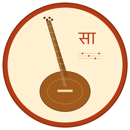

# Sangeet Notes Editor

<p align="center">
  
</p>

A desktop notation editor for **Hindustani classical music**, designed for sitar compositions in the **Bhatkhande notation style**. Type notes on your keyboard, see them rendered in Devanagari, hear them through MIDI, and export to PDF.

## Features

- **Bhatkhande notation** — grid/tabular layout with Devanagari swar glyphs (सा, रे, ग, म, प, ध, नि)
- **Keyboard-driven input** — type `s r g m p d n` for notes, Shift for komal/tivra variants
- **11 built-in taals** — Teentaal, Ektaal, Jhaptaal, Rupak, Dadra, Keherwa, and more
- **MIDI playback** — hear compositions with General MIDI sitar patch
- **PDF export** — print-ready output with composition header, raag info, and notation
- **`.swar` file format** — JSON-based, one file per composition
- **Sitar-specific** — mizrab strokes (Da/Ra), ornaments (meend, kan, murki, gamak, etc.)

## Keyboard Reference

| Key | Action |
|-----|--------|
| `s r g m p d n` | Enter swar (Sa Re Ga Ma Pa Dha Ni) |
| `Shift + key` | Komal variant (Re, Ga, Dha, Ni) or Tivra (Ma) |
| `.` (period) | Next note in mandra saptak (lower octave) |
| `'` (quote) | Next note in taar saptak (upper octave) |
| `` ` `` (backtick) | Return to madhya saptak |
| `Space` | Rest (silence) |
| `-` (minus) | Sustain (hold previous note) |
| `Backspace` | Delete last note |
| `Arrow keys` | Move cursor |

## Download

Go to [Releases](../../releases) for pre-built installers (macOS `.dmg`, Windows `.msi`, Linux `.deb`). All installers include a bundled JVM — no Java installation required.

## Build from Source

**Requirements:** JDK 17+, sbt

```bash
# Run the app
sbt "runMain sangeet.editor.MainApp"

# Run tests
sbt test

# Build native installer for your platform
./packaging/package.sh
```

## Tech Stack

- **Scala 3** + **ScalaFX** (JavaFX wrapper)
- **circe** for JSON serialization
- **Apache PDFBox** for PDF export
- **javax.sound.midi** for playback
- **sbt-assembly** + **jpackage** for native packaging

## Project Structure

```
sangeet/
  model/    — Pure domain types (no UI/IO deps)
  format/   — .swar JSON serialization, PDF export
  layout/   — BeatGrouper → LineBreaker → GridLayout
  render/   — Devanagari canvas rendering, ornaments
  audio/    — PlaybackScheduler, MidiEngine
  editor/   — UI: MainApp, EditorPane, KeyHandler, StatusBar
```

## License

This project is not yet licensed. All rights reserved.
