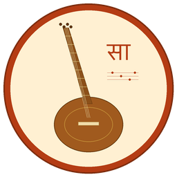

# Sangeet Notes Editor

<p align="center">
  
</p>

A multi-platform notation editor for **Hindustani classical music**, designed for sitar compositions in the **Bhatkhande notation style**. Type notes on your keyboard, see them rendered in Devanagari, hear them through MIDI, and export to PDF or HTML.

## Platforms

| Platform | Tech Stack | Status |
|----------|-----------|--------|
| **Desktop** | Scala 3 + ScalaFX (JavaFX) | Full-featured editor |
| **Web** | Elm 0.19 frontend + Scala 3 / Tapir REST backend | In development |
| **Android** | Planned | Not started |

## Features

- **Bhatkhande notation** — grid/tabular layout with Devanagari swar glyphs (सा, रे, ग, म, प, ध, नि)
- **Keyboard-driven input** — type `s r g m p d n` for notes, Shift for komal/tivra variants
- **Multi-script support** — Devanagari (default), with ScriptMap architecture for future scripts
- **11 built-in taals** — Teentaal, Ektaal, Jhaptaal, Rupak, Dadra, Keherwa, and more
- **26 built-in raags** — Yaman, Bhairav, Todi, Marwa, Hindol, Madmad Sarang, and more with full arohan/avrohan/pakad data
- **MIDI playback** — hear compositions with General MIDI sitar patch, play/pause/stop controls
- **Color-coded notation** — distinct colors for taal markers, swar, ornaments, octave dots, Da/Ra strokes, and sahitya across editor, PDF, and HTML
- **PDF export** — full multi-row rendering with Devanagari font support, ornaments, octave dots, strokes, and sahitya
- **HTML export** — browser-ready output with print-friendly CSS and all notation rows
- **`.swar` file format** — JSON-based, one file per composition
- **Sitar-specific** — mizrab strokes (Da/Ra), 10+ ornament types (meend, kan, murki, gamak, krintan, ghaseet, etc.)
- **Undo/redo** — full edit history
- **Section management** — add/remove/reorder sections (Sthayi, Antara, Taan, Jhala, Jod)
- **Sample composition** — opens with a rich Yaman Vilambit Gat showcasing all features
- **Cross-platform packaging** — native installers for macOS (.dmg), Windows (.msi), Linux (.deb) via GitHub Actions

## Download

Go to [Releases](../../releases) for pre-built installers (macOS `.dmg`, Windows `.msi`, Linux `.deb`). All installers include a bundled JVM — no Java installation required.

## Prerequisites

- **JDK 17+** (Temurin recommended)
- **sbt** (Scala build tool)
- **Node.js + npm** (for web frontend only)

## Desktop App

The desktop app is the primary platform — a standalone ScalaFX application with full editing, playback, PDF/HTML export capabilities.

```bash
# Compile
sbt sangeetDesktop/compile

# Run
sbt sangeetDesktop/run

# Build fat JAR
sbt sangeetDesktop/assembly
# Output: sangeet-desktop/target/scala-3.4.2/sangeet-notes-editor.jar
```

## Web App

The web app has two components: a Scala REST backend and an Elm SPA frontend. The backend exposes the core music model and editor logic as a stateless API. The frontend manages all state client-side.

### Backend (Scala Server)

```bash
# Run the server (default port 28080)
sbt sangeetServer/run

# Or with a custom port
PORT=9090 sbt sangeetServer/run
```

- REST API: `http://localhost:28080/api/v1/`
- Swagger UI: `http://localhost:28080/docs`
- Health check: `http://localhost:28080/health`

### Frontend (Elm)

```bash
# Install dependencies (first time only)
cd sangeet-web && npm install

# Development with live reload
npx elm-live src/Main.elm --open --dir=public -- --output=public/elm.js

# Production build
npx elm make src/Main.elm --optimize --output=public/elm.js
```

### Running Both Together

1. Start the backend: `sbt sangeetServer/run`
2. In another terminal: `cd sangeet-web && npx elm-live src/Main.elm --open --dir=public -- --output=public/elm.js`

Or use the Makefile:

```bash
make server    # Terminal 1: start backend on port 28080
make web-dev   # Terminal 2: start frontend with live reload
```

## Debug Console

The desktop app includes a TCP debug console for inspecting and interacting with the running editor from a terminal. It starts automatically on `127.0.0.1:28081`.

```bash
# Connect
nc 127.0.0.1 28081

# Or with readline support
rlwrap nc 127.0.0.1 28081

# Scripted one-shot
echo "get-state" | nc 127.0.0.1 28081
```

| Command | Description |
|---------|-------------|
| `ping` | Health check |
| `help` | List all commands |
| `type <key>` | Simulate swar input (`type m` for Ma, `type S` for komal Re) |
| `press <key>` | Simulate special key (`space`, `backspace`, `minus`, `left`, `right`) |
| `get-state` | Cursor position, section, event count, edit mode |
| `get-events` | All events in current section |
| `dump-composition` | Full composition as JSON |
| `dump-history` | Undo/redo stack sizes |
| `check-focus` | Which UI node has keyboard focus |
| `focus` | Force focus back to editor |
| `thread-dump` | JVM thread dump (works even during UI freeze) |
| `set-debug on\|off` | Toggle verbose debug logging |

## Tests

```bash
sbt sangeetCore/test       # Core library (429 tests, including 38 editor stress tests)
sbt sangeetServer/test     # Server API (9 tests)
sbt sangeetDesktop/test    # Desktop integration tests (37 TCP tests via DebugConsole)
sbt test                   # All tests (475 total)
```

### TCP Integration Tests (`DebugConsoleTcpSpec`)

The desktop module includes 37 integration tests that exercise the editor over a real TCP socket connection to the debug console. These tests run headless (no display needed) and cover:

- All swar keys, komal/tivra variants, octave changes, dual swar
- Rest, sustain, backspace, beat subdivisions
- All ornament types (meend, kan, murki, gamak, andolan, krintan, gitkari, ghaseet, sparsh, zamzama)
- Mizrab strokes (da, ra, chikari, jod)
- Section switching, composition reset, different taals
- Undo history tracking, cursor position verification
- JSON serialization round-trip, thread dump, focus management
- Log file verification (`/tmp/sangeet-notes-editor.*.log`)

## Keyboard Reference

| Key | Action |
|-----|--------|
| `s r g m p d n` | Enter swar (Sa Re Ga Ma Pa Dha Ni) |
| `Shift + key` | Komal variant (Re, Ga, Dha, Ni) or Tivra (Ma) |
| `ss rr gg` etc. | Dual swar (double-tap for SaSa, ReRe, etc.) |
| `.` (period) | Next note in mandra saptak (lower octave) |
| `'` (quote) | Next note in taar saptak (upper octave) |
| `` ` `` (backtick) | Return to madhya saptak |
| `Space` | Rest (silence) |
| `-` (minus) | Sustain (hold previous note) |
| `Backspace` | Delete last note |
| `Arrow keys` | Move cursor |
| `Tab` | Next section |
| `Ctrl+Z / Ctrl+Y` | Undo / Redo |
| `Ctrl+S` | Save |
| `Ctrl+E` | Export PDF |

## Project Structure

```
sangeet-core/       Pure JVM library — domain model, editor logic, layout, codecs, audio, API layer
sangeet-desktop/    ScalaFX desktop application (primary UI)
sangeet-server/     Tapir HTTP server exposing core as REST API with Swagger
sangeet-web/        Elm 0.19 single-page application
```

## Tech Stack

- **Scala 3** + **ScalaFX** (desktop) / **Tapir + http4s** (server)
- **Elm 0.19** (web frontend)
- **circe** for JSON serialization
- **Apache PDFBox** for PDF export (with Noto Sans Devanagari font)
- **javax.sound.midi** for playback / **Web Audio API** (web)
- **ScalaTest** (475 tests)
- **sbt-assembly** + **jpackage** for native packaging
- **GitHub Actions** for CI/CD and cross-platform release builds

## License

This project is not yet licensed. All rights reserved.
